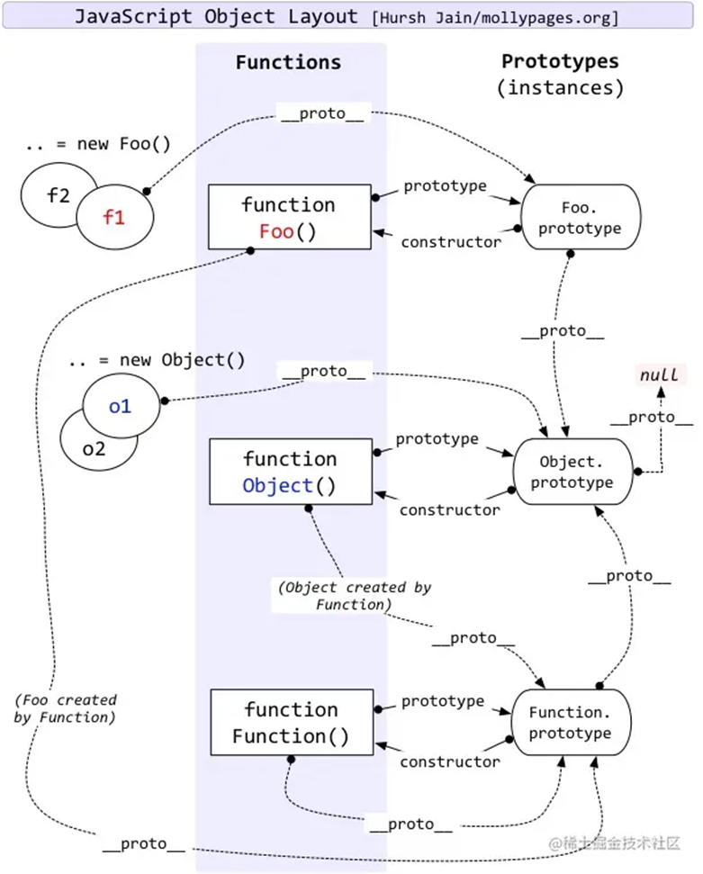

### JS 数据类型

JS 数据类型分为 **_基本数据类型_** 和 **复杂数据类型**

基本数据类型：Number、String、Boolean、undefined、null、symbol、bigInt （放在栈中）

复杂数据类型：Object （放在堆中）

### 如何判断数据类型？（3 种方式）

typeof：不能判断复杂数据类型

instanceof：判断某个实例的原型

Object.prototype.toString.call()：所有数据都能判断

#### var、let、const 的区别

- var 声明是全局作用域或者函数作用域，let 和 const 是块作用域
- var 变量可以重新赋值和声明，let 可以重新赋值不能重复声明，const 不可以重新赋值不能重复声明
- 都可以变量提升到作用域顶部，var 初始化为 undefined，let 和 const 不能初始化
- 声明期间，var 和 let 可以不初始化，const 必须初始化

#### 原型和原型链

- 每个**_函数_**都有一个 prototype 属性。**_函数_**的 prototype 属性指向了一个对象，这个对象正是调用该构造函数而创建的**实例**的原型

- 每个**_实例对象_**都有 proto 属性指向该对象的原型

- 每个**_原型对象_**（**_原型对象_**就是通过 Object 构造函数生成的）都有一个 constructor 属性指向关联的构造函数

  原型链：当读取实例的属性时，如果找不到，就会查找与对象关联的原型中的属性，如果还查不到，就去找原型的原型，一直找到最顶层为止。



### 作用域和作用域链

作用域分为：全局作用域和块级作用域

作用域：确定当前执行代码对变量的访问权限。

> **_函数的作用域在函数定义的时候就决定了。_**
>
> **_JavaScript 采用的是词法作用域，函数的作用域基于函数创建的位置_**

作用域链：当查找某个变量时，从当前作用域开始逐级向上查找，直至找到全局作用域还未找到就停止查找，抛出异常。这种层级关系就叫做作用域链

### 执行上下文

执行上下文栈：默认全局执行上下文在最底部，所有代码执行完毕后才会弹出。**当执行一个函数的时候**，就会创建一个执行上下文，并压入执行上下文栈中，函数执行完毕后，函数的执行上下文会从栈中弹出。

当 JavaScript 代码执行一段可执行代码时，会创建对应的执行上下文。对于每个执行上下文，都有三个重要属性：

a) 变量对象（Variable object，VO）：存储上下文中定义的变量和函数(全局对象和函数对象)；

- ***全局上下文***_的_***变量对象***初始化是全局对象

- ***函数上下文***的变量对象初始化只包括 **_Arguments 对象_**

- 在进入执行上下文时会给变量对象添加形参、函数声明、变量声明等初始的属性值（代码还没执行）

- 在代码执行阶段，会再次修改变量对象的属性值

  > 在进入执行上下文时，首先会处理函数声明，其次会处理变量声明，如果变量名称跟已经声明的形式参数或函数相同，则变量声明不会干扰已经存在的这类属性。（相同的变量和函数声明以函数为准）

b) 作用域链（Scope chain）；

- 当***函数创建***的时候，就会保存所有父变量对象到其中，你可以理解 [[scope]] 就是所有父变量对象的层级链，但是注意：[[scope]] 并不代表完整的作用域链！
- 当***函数激活***时，进入函数上下文，创建 VO/AO 后，就会将活动对象添加到作用链的前端。
  c) this。（this 指向）

### 闭包

定义：那些能够访问自由变量的函数

闭包 = 函数 + 函数能够访问的自由变量（在函数中使用的，既不是函数参数也不是函数的局部变量的变量）

> 在某个内部函数的执行上下文创建时，会将父级函数的**活动对象**加到内部函数的 `[[scope]]` 中，形成作用域链，所以即使父级函数的执行上下文销毁（即执行上下文栈弹出父级函数的执行上下文），但是因为其**活动对象**还是实际存储在内存中可被内部函数访问到的，从而实现了闭包。

### new 的实现

1. 创建一个空对象
2. 把这个对象的[[proto]]链接到构造函数的 prototype
3. 构造函数的 this 指向这个对象，执行构造函数的代码
4. 返回这个对象

### this，怎么改变 this？手写 call，apply，bind

**_this 永远指向最后调用它的那个对象_**

- 箭头函数无 this

- new 调用：绑定到新创建的对象

- bind：多次 bind 只认第一次绑定，箭头函数中 this 不会被修改

- apply、call

- 对象

- 直接调用

### 手写 call

```javascript
Function.prototype.myCall = function (target, ...args) {
  target = target || window;
  const symbolKey = Symbol();
  target[symbolKey] = this;
  const res = target[symbolKey](...args);
  delete target[symbolKey];
  return res;
};
```

### 手写 apply

```javascript
Function.prototype.myApply = function (target, args) {
  target = target || window;
  const symbolKey = Symbol();
  target[symbolKey] = this;
  const res = target[symbolKey](...args);
  delete target[symbolKey];
  return res;
};
```

Call 和 apply 的区别就是，**_apply 传入的是数组，call 传入的是一个个值_**

### 手写 bind

```javascript
Function.prototype.myBind = function (target, ...outArgs) {
  target = target || {};
  const symbolKey = Symbol();
  target[symbolKey] = this;
  return function (...innerArgs) {
    const res = target[symbolKey](...outArgs, ...innerArgs);
    return res;
  };
};
```

### 手写深拷贝

```javascript
function deepClone(obj = {}, map = new WeakMap()) {
  if (typeof obj != "object") return obj;
  if (map.get(obj)) return map.get(obj);
  let result = Array.isArray(obj) ? [] : {};
  map.set(obj, result);
  for (const key in obj) {
    if (Object.hasOwnProperty.call(obj, key)) {
      result[key] = deepClone(obj[key], map);
    }
  }
  return result;
}
```

## 异步

### event loop、宏任务、微任务

​ 宏任务：setTimeout，setInterval，Ajax，DOM 事件。 微任务：Promise async/await。

​ 两者区别：

- 宏任务：DOM 渲染后触发，如 `setTimeout` 、`setInterval` 、`DOM 事件` 、`script` 。

- 微任务：DOM 渲染前触发，如 `Promise.then` 、`MutationObserver` 、Node 环境下的 `process.nextTick` 。

### promise

#### 手写 promise.all

```js
Promise.all = function (promises) {
  return new Promise((resolve, reject) => {
    if (typeof promises[Symbol.iterator] !== "function") {
      reject("Type error");
    }
    if (promises.length === 0) {
      resolve([]);
    } else {
      const res = [];
      let count = 0;
      const len = promises.length;
      for (let i = 0; i < len; i++) {
        Promise.resovle(promises[i])
          .then((data) => {
            res[i] = data;
            if (++count == i) {
              resolve(res);
            }
          })
          .catch((err) => {
            reject(err);
          });
      }
    }
  });
};
```

### async/await 和 Promise 的关系

- async/await 是消灭异步回调的终极武器。

- 但和 Promise 并不互斥，反而，两者相辅相成。

- 执行 async 函数，返回的一定是 Promise 对象。

- await 相当于 Promise 的 then。

- try...catch 可捕获异常，代替了 Promise 的 catch。

